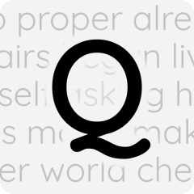

<h1>Our Games</h1>

  

    <h2>Quuwords</h2>
    
  

  

    
<strong>Quuwords</strong> is an exciting word search game that offers both solo and online competitive modes. Dive into a world of letters and challenge yourself to find hidden words in a grid of jumbled characters. Whether you prefer to play alone and beat your own high scores or compete against friends and players from around the globe, <strong>Quuwords</strong> has something for everyone. Engage in thrilling head-to-head matches, climb the leaderboards, and prove your word-finding prowess. Challenge your friends, sharpen your mind, and become a word search champion with <strong>Quuwords</strong>!

    <strong>Support Email:</strong> <a href="mailto:info@constantwave.tech">info@constantwave.tech</a>
  

